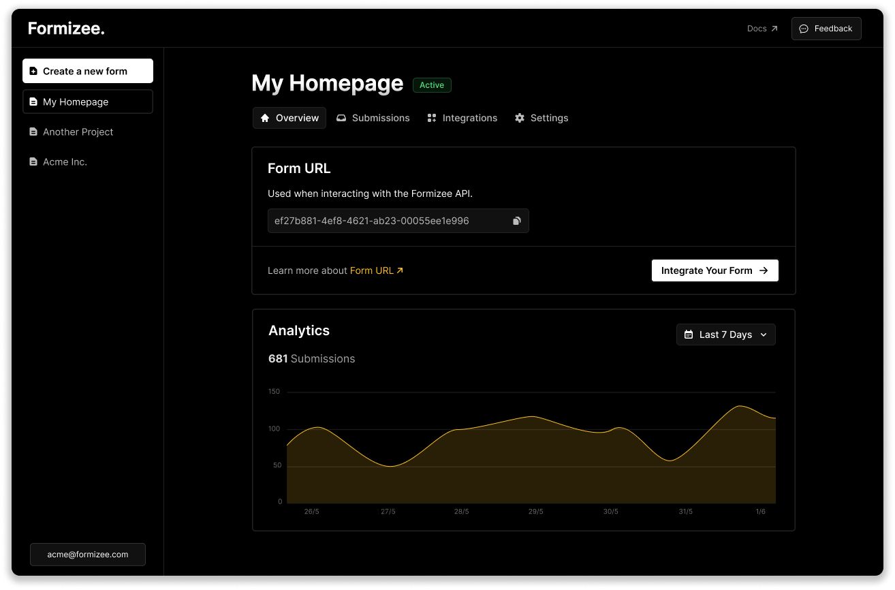

    

<h1 align="center">Formizee.</h1>
    
<h4 align="center">
  <a> ⚡️ Features  </a>
  ·
  <a> 📚 Docs </a>
  ·
  <a> 🗣️  Support </a>
</h4>

<a target="_blank" href="https://formizee.com/">Formizee</a> is a open source Formspree alternative.  We're building the future of forms backend, just keeping things simple.

