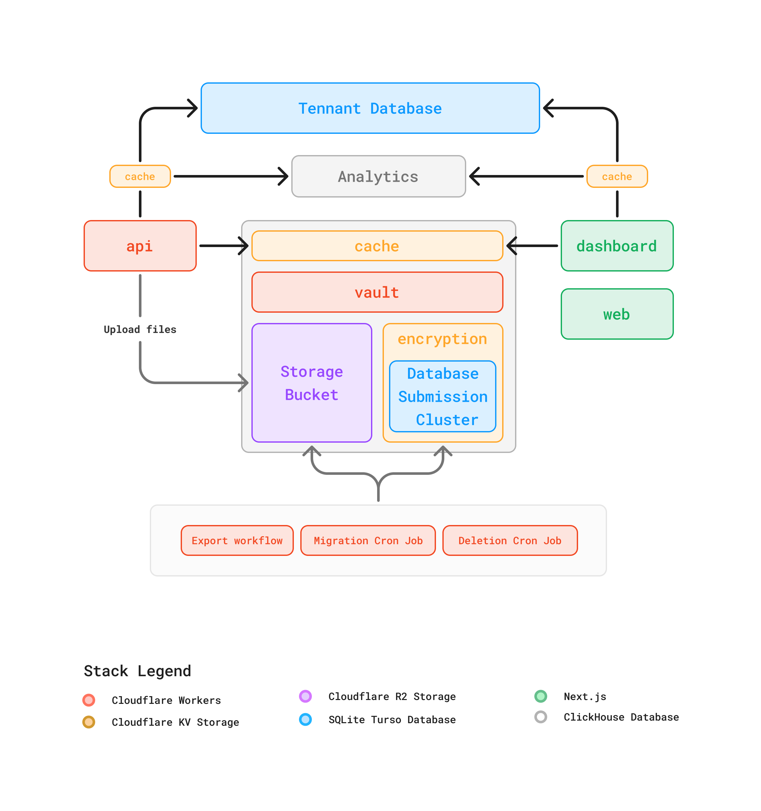
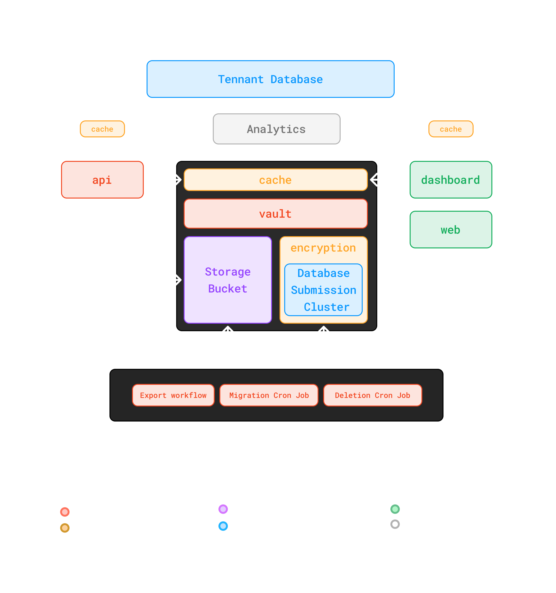

## Databases
We use [Turso](https://turso.tech/) with LibSQL for the databases.

### Tenant Database
The **Tenant Database** is the primary data store for all tenant-related information. This serves as the central source of truth for user configurations, relationships, and settings.

### Database Submission Cluster
The **Database Submission Cluster** is composed of a main  `shared-submissions` database, this database is the default source of the submissions.

Also, if a workflow detects more than 10.000 submissions of a single endpoint inside the `shared-submissions` database, the workflow will perform a migration to a new database specifically for that endpoint

- **Purpose**: Lightweight and scalable database cluster for handling high volumes of submissions efficiently.
- **Security**: This cluster is isolated, and is only accessed from the **Vault** service.

## Storage
The **Storage Bucket** is a distributed object store for file uploads and other unstructured data.

We use [Cloudflare R2](https://www.cloudflare.com/es-es/developer-platform/products/r3/) in production.

### Local Development
As a alternative, since we use the S3 protocol, when you setup the docker container, this includes a minio image already configured to be compatible with the stack.

## Services

### API
The **API** is it self a REST API that allows the user to manage the entire workspace. But also is the responsible of handle the upload of submissions.

- **Technology**: [Cloudflare Workers](https://workers.cloudflare.com/)

### Vault
The **Vault** is responsible for securely managing submissions:

- **Technology**: [Cloudflare Workers](https://workers.cloudflare.com/)
- **Security**: We use a AES-GCM key for each endpoint created for store the submissions.
- **Caching**: Temporary storage to accelerate secure operations.

### Dashboard
The **Dashboard** is the user-facing application that provides insights and control over tenant data.

- **Technology**: [Next.js](http://nextjs.org)
- **Features**:
  - Real-time analytics visualization.
  - Management of workflows, configurations, and user data.

### Analytics
We use [Tinybird (Clickhouse)](http://tinybird.co) as analytics and metrics service
See `/internal/analytics` and `/internal/metrics` for the source code

This architecture ensures scalability, security, and efficiency in handling form submissions, tenant management, and analytics. If you need additional details or diagrams, feel free to reach out!
