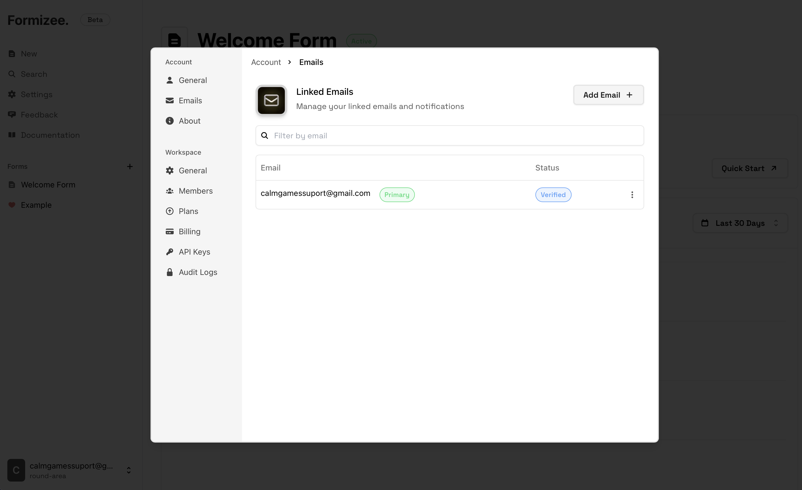
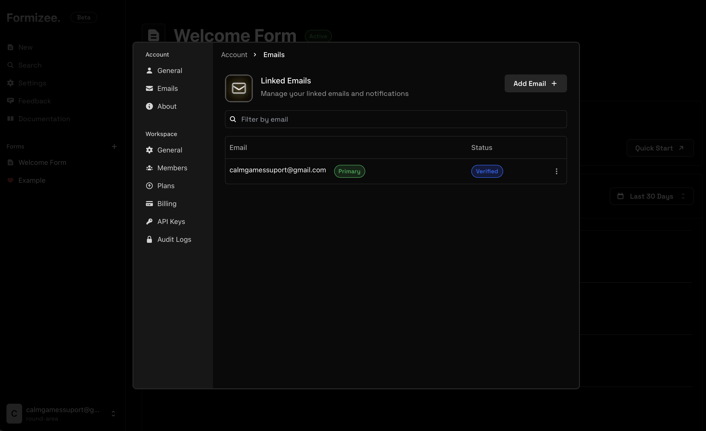
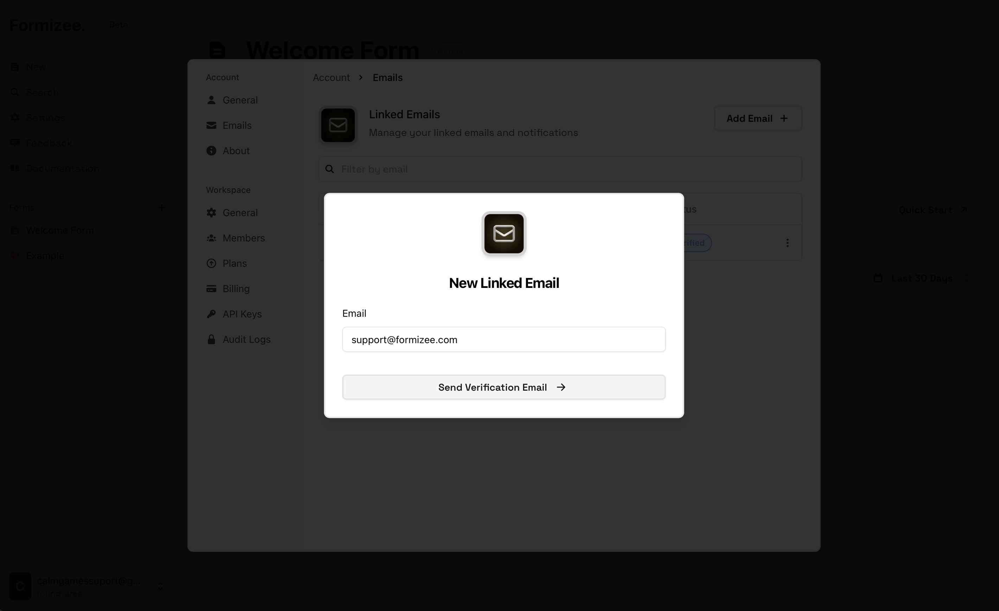
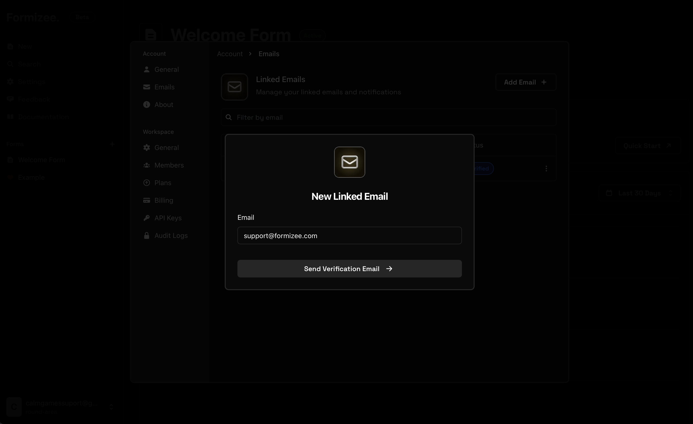
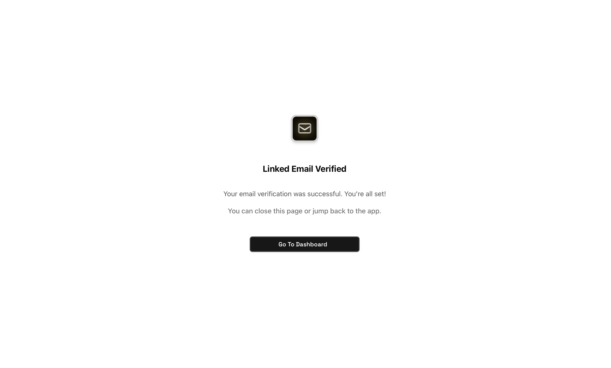
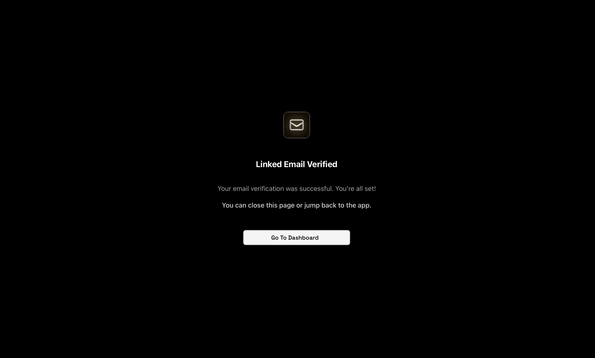
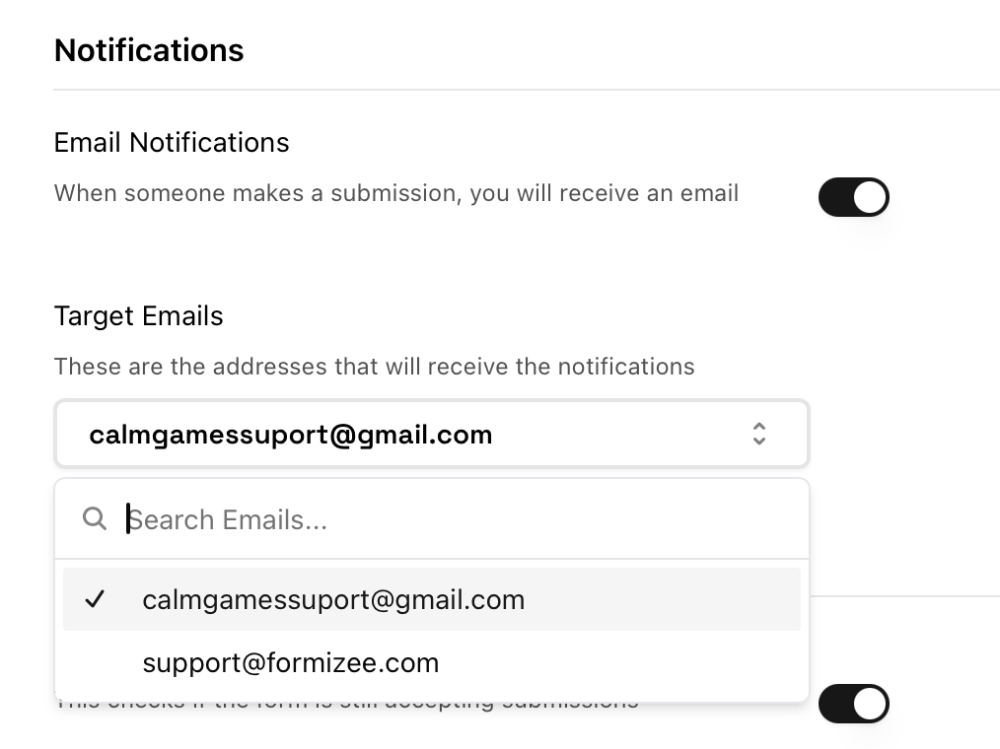
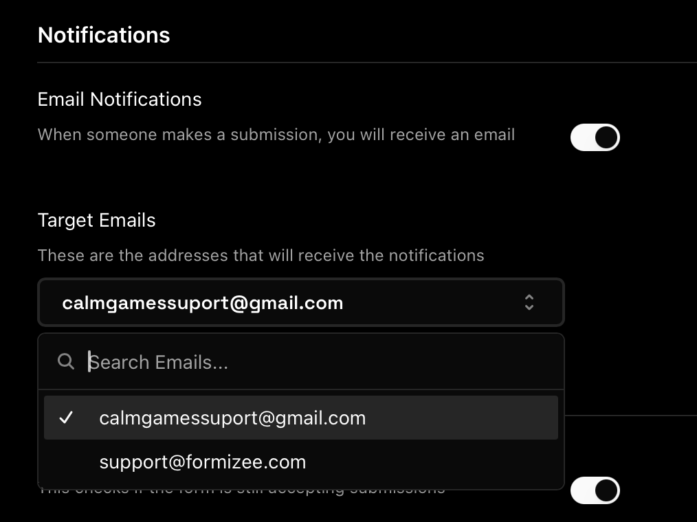

### Prerequisites
To get the most out of this guide, you'll need to:

* [Create a Formizee account](https://dashboard.formizee.com)

## 1. Go to Settings
Now that we are inside the dashboard, we will click on the **"Settings"** button on the sidebar.
Then go to **Account > Linked Emails**

<Frame>
  
  
</Frame>

## 2. Add a new email
Now press on the **"Add Email"** button and put the email that you want link with Formizee.

<Frame>
  
  
</Frame>

This will send a email verification to the selected address.

## 3. Verify your email
After you verify your address through the mail sended by Formizee, you should see that your new address is `verified`

<Frame>
  
  
</Frame>

## 5. Use your new linked email
Now you can go to a form and add your new address to the `target emails`, this will trigger a notification when a submission is upload.

<Frame>
  
  
</Frame>
