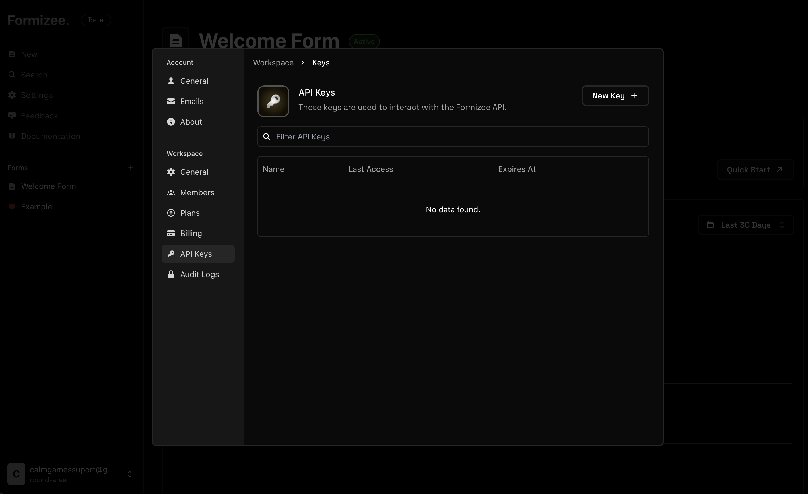

### Prerequisites
To get the most out of this guide, you'll need to:

* [Create a Formizee account](https://dashboard.formizee.com)

## 1. Login into the Dashboard

<Frame>
  
  
</Frame>

## 2. Go to Settings
Now that we are inside the dashboard, we will click on the **"Settings"** button on the sidebar.
Then go to **Workspace > API Keys**

<Frame>
  
  
</Frame>

## 3. Create a API Key
Now press on the **"New Key"** button to open the create dialog, here you can assign a name and a expiration date to the key.

_We recommend to set carefully the **Expiration Date** of the key._

<Frame>
  
  
</Frame>

## 4. Copy your API Key
That's it, you new API Key is created, now it should be copied into your clipboard:

<Frame>
  
  
</Frame>

## 5. Test your API key
Open your terminal and paste the next code:

<Tabs>
  <Tab title="cURL">
  ```bash
  curl -X GET 'https://api.formizee.com/v1/submissions/<your_endpoint_id>' \
    -H 'Content-Type: application/json' \
    -H 'Authorization: bearer <your_api_key>'
  ```
  </Tab>
  <Tab title="wget">
  ```bash
  wget --method GET \
    --header 'Content-Type: application/json' \
    --header 'Authorization: bearer <your_api_key>' \
  'https://api.formizee.com/v1/submissions/<your_endpoint_id>' 
  ```
  </Tab>
</Tabs>

You should see all the submissions of your form, like this:
```json
{
  "_metadata": {
    "page": 1,
    "totalPages": 1,
    "itemsPerPage": 100,
    "schema": {
      // This is the schema of the submissions
      "name": "string",
      "email": "string",
      "attachment": "file"
    }
  },
  // And here goes the content
  "submissions": []
}
```

<Warning>The only types shown in the schema are `string` and `file`, do not expect *number* or *boolean* values.</Warning>

## 6. Next steps
Now that you know how to create API Keys, see the **API reference** to unleash all the power!

<Card icon="database" href="/api-references/submissions/list" title="API Reference"/>
