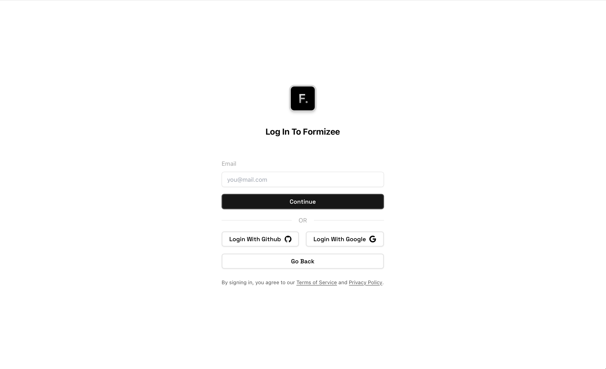
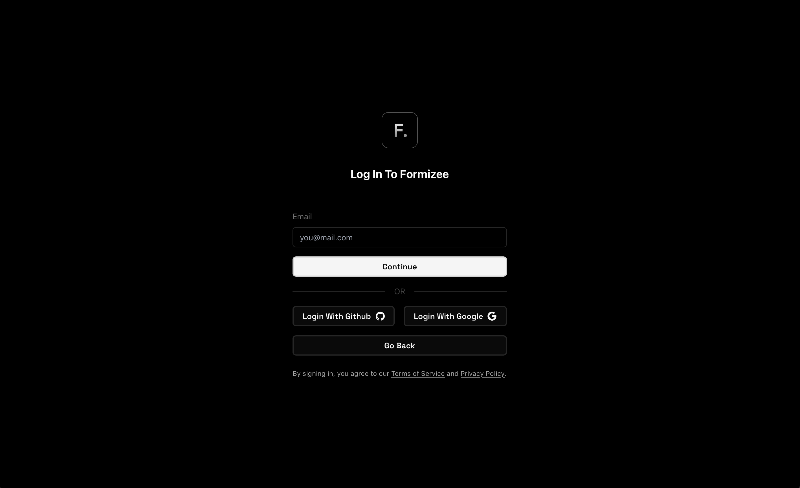
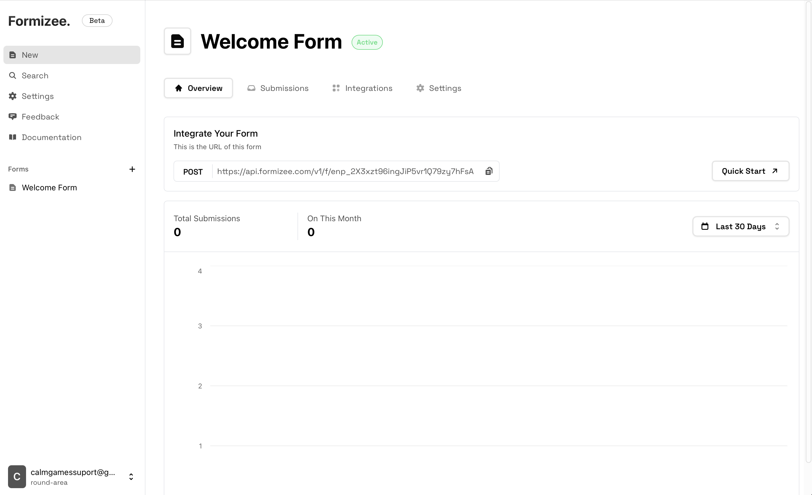
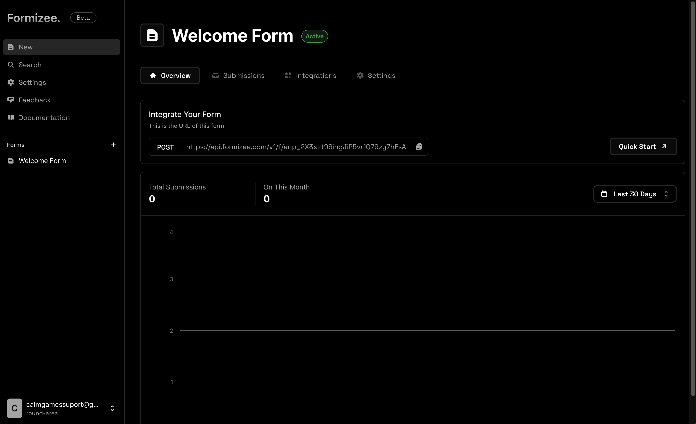
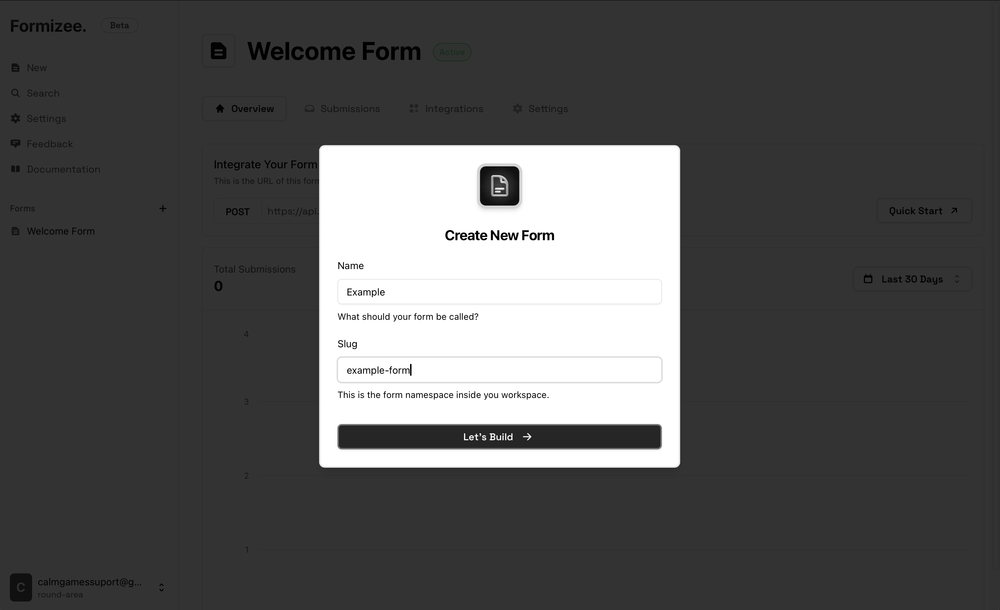
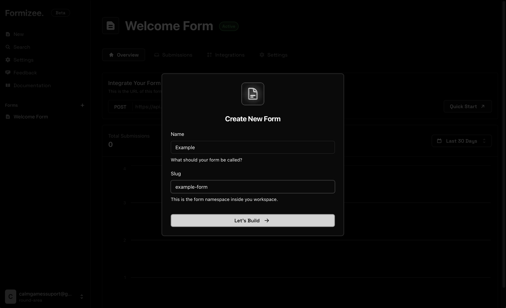
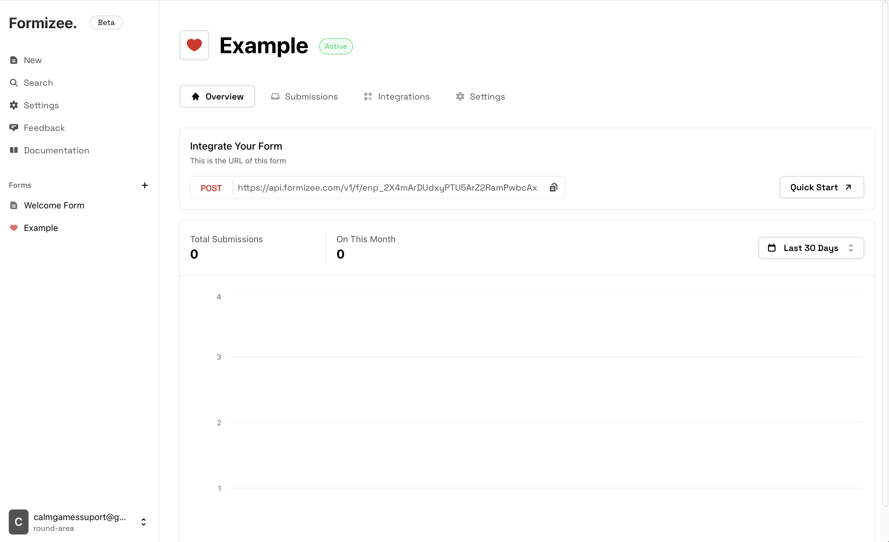
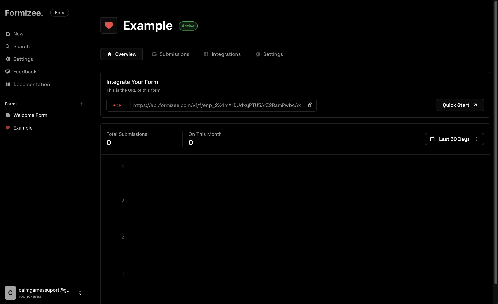

## 1. Create your Formizee account
The first step to using Formizee is to create an account. You can do this by visiting [dashboard.formizee.com](https://dashboard.formizee.com) or by clicking the Dashboard button in the top right of your screen.

<Frame caption="Create your account">
  
  
</Frame>

## 2. The Dashboard
As soon as you create your account, you will be redirected to the main workbench of Formizee, the Dashboard.
Here you can build, design and and monitorize all your forms and data.

<Info>If you are more of a terminal style user (btw), you can also use the **API**, it's fully featured to work with.</Info>

<Frame caption="The Dashboard">
  
  
</Frame>

## 3. Create your first form
Now that we are inside the dashboard, we will click on the "New" button on the top of the sidebar.
This will show a dialog to create your form.

<Frame caption="Create your form">
  
  
</Frame>

## 4. Your form is ready
Now you can see your brand new form, customize the appearance is you want _(icon, colors...)_
If you look closer, in the first section appears your `Endpoint URL`, this is used to integrate the form within your app.

<Frame caption="Create your form">
  
  
</Frame>

<Tip>You can also see the Endpoint ID on the settings tab under "Formizee ID"</Tip>

## 5. Next steps

Now that your form is created, we recommend our quickstart templates for your framework of choice.
<CardGroup cols={2}>
  <Card icon="link" href="/introduction" title="See Quickstarts" horizontal={true}/>
</CardGroup>
