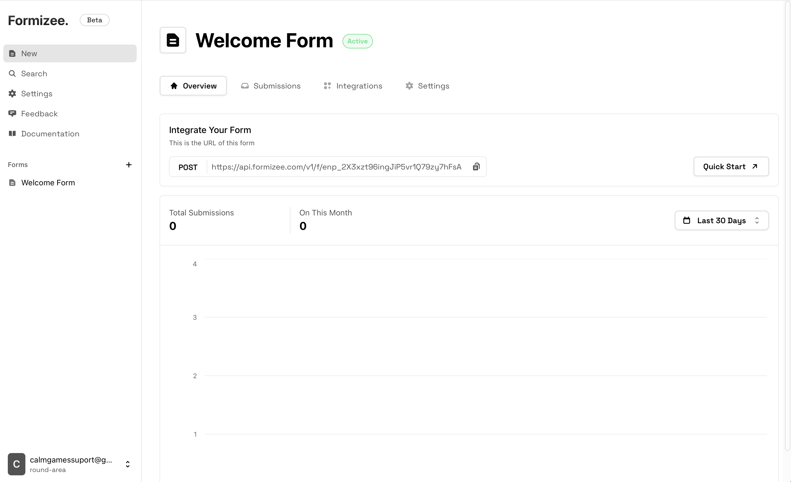

### Prerequisites
To get the most out of this guide, you'll need to:

* [Create a Formizee account](https://dashboard.formizee.com)
* [Have a form created](/guides/create-your-first-form)

## 1. Update your form
Update your form to use `enctype='multipart/form-data'` and add a input inside:

```tsx index.html {1,11}
<form method="post" enctype='multipart/form-data' action="https://api.formizee.com/v1/f/enp_123456">
  <label for="name">
    Name
    <input id="name" autoComplete="name" name="name" />
  </label>
  <label for="email">
    Email
    <input id="email" autoComplete="email" name="email" />
  </label>
  <label for="attachment">
    <input id="attachment" name="attachment" />
  </label>
  <button type="submit">Submit</button>
</form>
```

## 2. See on your Dashboard
Now if you make a submissions, you should see your attachment on the dashboard.

<Frame>
  
  
</Frame>

---

<Warning>
### File Uploads Limitations
  At the moment the files feature has some limitations:

**Max file size **50 Mb**.**
  Since we are running our infrastructure on the edge, we only support 50 Mb to prevent issues.
  *We have planned to increase this limit in a future.*

**Multifile inputs are not supported.**
  At the moment uploading multiple files with a single input will result on a single file uploaded (the first selected).
</Warning>

