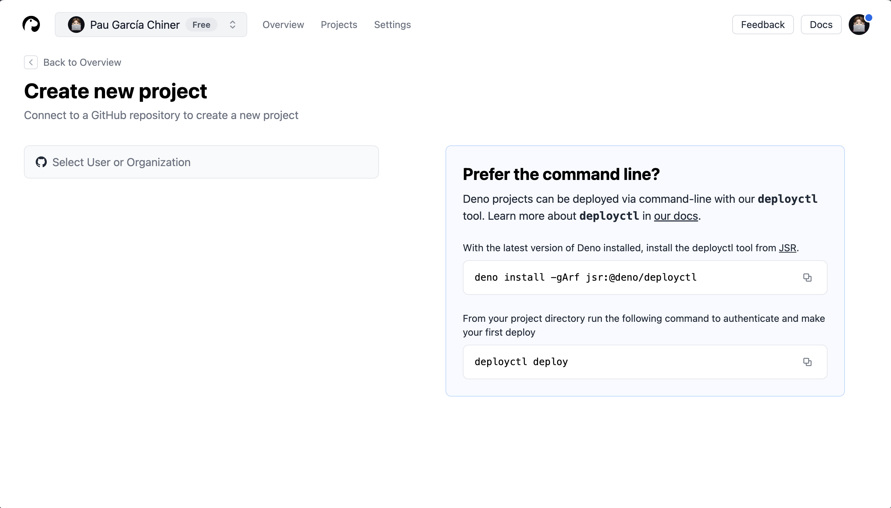
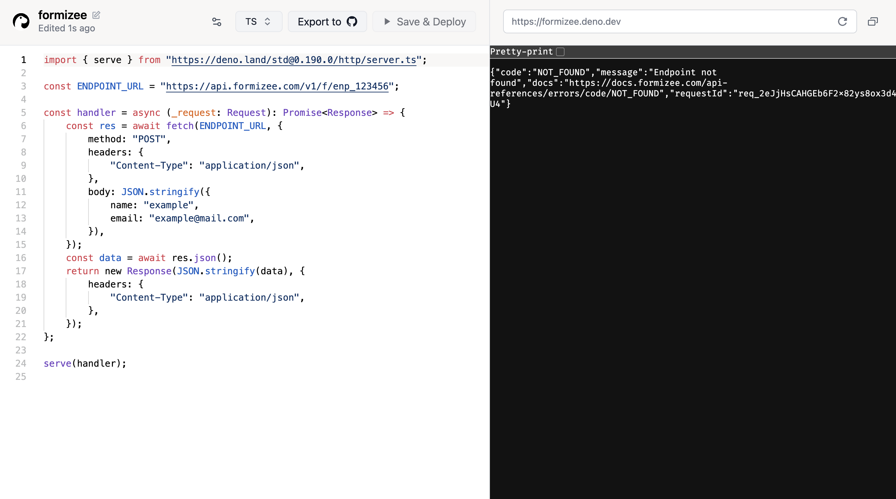

### Prerequisites
To get the most out of this guide, you'll need to:

* [Create a Formizee account](https://dashboard.formizee.com)
* [Have a form created](/guides/create-your-first-form)

## 1. Create a Deno Deploy project

Go to [dash.deno.com/projects](https://dash.deno.com/projects) and create a new playground project

<Frame>
  
</Frame>

## 2. Edit the handler function
Paste the following code into the browser editor and update the **ENDPOINT_URL**.

```ts index.ts {3}
import { serve } from "https://deno.land/std@0.190.0/http/server.ts";

const ENDPOINT_URL = "https://api.formizee.com/v1/f/enp_123456";

const handler = async (_request: Request): Promise<Response> => {
	const res = await fetch(ENDPOINT_URL, {
		method: "POST",
		headers: {
			"Content-Type": "application/json",
		},
		body: JSON.stringify({
			name: "example",
			email: "example@mail.com",
		}),
	});
	const data = await res.json();
	return new Response(JSON.stringify(data), {
		headers: {
			"Content-Type": "application/json",
		},
	});
};

serve(handler);
```

## 3. Deploy and ingest submissions
Click on `Save & Deploy` at the top of the screen.

<Frame>

</Frame>

## 4. Try it yourself
<Card title="Formizee Deno Deploy Example" icon="link" href="https://github.com/formizee/formizee-deno-deploy-example">
  See the full source code
</Card>
